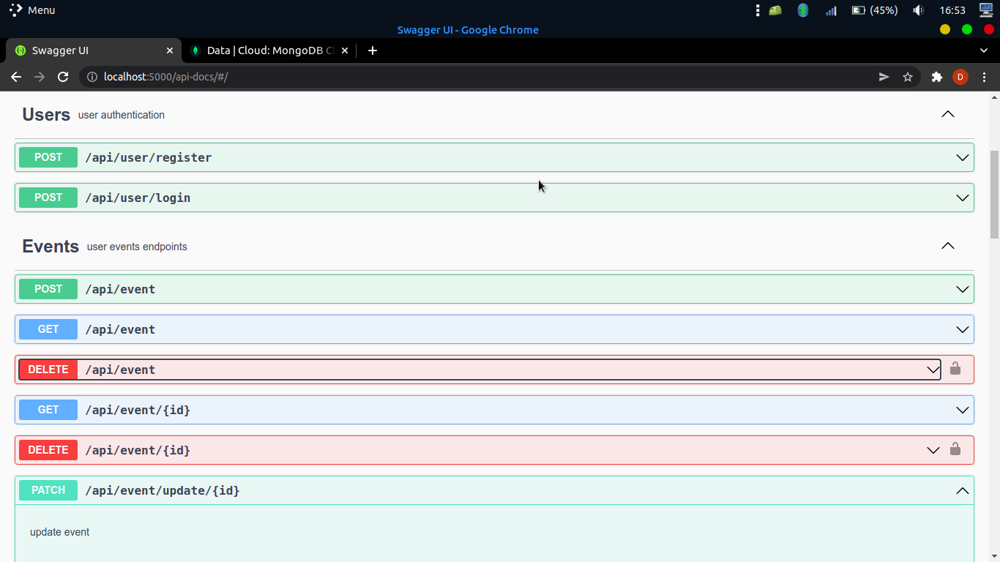

# user_event_api
 An api that allows a user to schedule events.
<div>
</div>

## Built With

- JAVASCRIPT
- NODEJS
- SWAGGER-UI


## Getting Started

To get a local copy, follow these simple example steps.

### Prerequisites

A computer with a working and up to date web browser.

### Setup

- Clone the repository to your folder of choice using Git (or just download all the files)
- Install vscode or any IDE of your choice
- Run npm install

```
$ git clone https://github.com/saretoduncan/user_event_api.git
$ cd user_event_api
$ npm install

```
### Live Link & Documentation
- https://usereventapi.herokuapp.com/api-docs/

## Author

👤 **Author**

By Duncan Kipkosgei Moiyo

- GitHub: [@saretoduncan](https://github.com/saretoduncan)
- twitter: [@duncan_sareto](https://twitter.com/duncan_sareto)
- email: <a href="mailto:duncan.moiyo@gmail.com"> mail📪</a>

## 🤝 Contributing

Contributions, issues, and feature requests are welcome!

Feel free to check the [issues page](./ISSUE_TEMPLATE/feature_request.md).


## Show your support

Give a ⭐️ if you like this project!


## 📝 License

This project is [MIT](./LICENSE) licensed.
